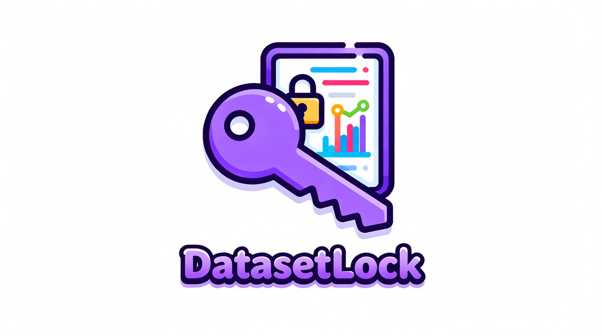

<h1 align="center">🪐 Awesome Dataset Copyright Protection</h1>

<b>
🚀 An UP-TO-DATE curated list of research and techniques for <strong>dataset copyright protection</strong> in AI models.
</b>

  
  
  
  

## 📑 Navigation

| [🌁 Image Domain](#-image-domain) | [🎧 Audio Domain](#-audio-domain) | 📚 [Related Repos](#-related-repos)

 
- Each domain has been categoried into **Unlearnable** and **Traceable**. Unlearnable means the dataset is designed to prevent model training, while Traceable means the dataset is designed to trace back the data usage in trained models. 
- PRs are welcome!

## 🌁 Image Domain

### Unlearnable：
- **Glaze: Protecting Artists from Style Mimicry by Text-to-Image Models**
    - Usenix 2023
    - Shawn Shan with Haitao Zheng & Ben Y. Zhao from University of Chicago
    - [Paper](https://www.usenix.org/system/files/usenixsecurity23-shan.pdf)

### Traceable：
- **(CoprGuard) Harnessing Frequency Spectrum Insights for Image Copyright Protection Against Diffusion Models**
    - CVPR 2025
    - Zhejiang University
    - [Paper](https://openaccess.thecvf.com/content/CVPR2025/papers/Liu_Harnessing_Frequency_Spectrum_Insights_for_Image_Copyright_Protection_Against_Diffusion_CVPR_2025_paper.pdf) [Code](https://github.com/sccsok/CoprGuard)

    
<!-- | Work | Affliation| Pub | Code | Target |
|------|---------|---------|---------|---------|
| **CoprGuard**  | Zhejiang University | CVPR 2025 | - | Diffusion Models |
 -->

 

## 🎧 Audio Domain

### Unlearnable：
- **Harmonycloak: Making Music Unlearnable for Generative AI**
    - SP 2025
    - Syed Irfan Ali Meerza with Jian Liu From University of Tennessee, Knoxville
    - [Paper](https://ieeexplore.ieee.org/document/11023354) [Audio Samples](https://mosis.eecs.utk.edu/harmonycloak.htm)

### Traceable：
- **AUDIO WATERMARK: Dynamic and Harmless Watermark for Black-box Voice
Dataset Copyright Protection**
    - Usenix Security 2025
    - Hanqing Guo from University of Hawaii at Manoa
    - [Paper](https://www.usenix.org/system/files/conference/usenixsecurity25/sec25cycle1-prepub-1193-guo-hanqing.pdf) [Code](https://github.com/audiowatermark/audiowatermark.github.io)
 

## 📚 Related Repos

- [Awesome-GenAI-Watermarking](https://github.com/and-mill/Awesome-GenAI-Watermarking)
- [Awesome-LLM-Copyright-Protection](https://github.com/Xuzhenhua55/awesome-llm-copyright-protection)

## Contribution
We welcome contributions! Feel free to open an issue or submit a pull request.
