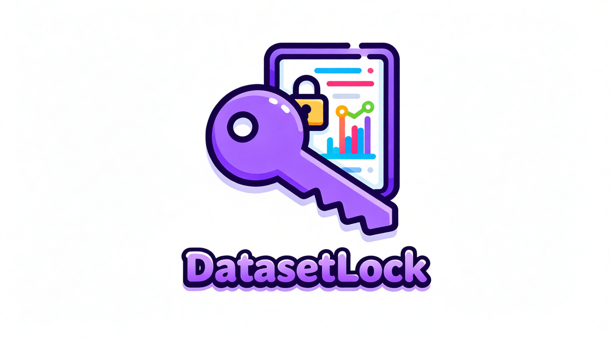

<h1 align="center">🪐 Awesome Dataset Copyright Protection</h1>

<b>
🚀 An UP-TO-DATE curated list of research and techniques for <strong>dataset copyright protection</strong> in AI models.
</b>

  
  
  
  

## 📑 Navigation

| [🌁 Image Domain](#-image-domain) | [🎧 Audio Domain](#-audio-domain) | 📚 [Related Repos](#-related-repos)

 
- Each domain has been categoried into **Unlearnable** and **Traceable**. Unlearnable means the dataset is designed to prevent model training, while Traceable means the dataset is designed to trace back the data usage in trained models. 
- PRs are welcome!

## 🌁 Image Domain

- **SoK: Dataset Copyright Auditing in Machine Learning Systems**
    - SP 2025
    - Linkang Du, Xuanru Zhou, Min Chen, Chusong Zhang, Zhou Su, Peng Cheng, Jiming Chen, Zhikun Zhang* 
    - Xi’ an Jiaotong University & Zhejiang University
    - [Paper](https://www.usenix.org/system/files/usenixsecurity23-shan.pdf)

### Unlearnable：
- **Glaze: Protecting Artists from Style Mimicry by Text-to-Image Models**
    - Usenix 2023
    - Shawn Shan, Jenna Cryan, Emily Wenger, Haitao Zheng, Rana Hanocka, Ben Y. Zhao 
    - University of Chicago
    - [Paper](https://www.usenix.org/system/files/usenixsecurity23-shan.pdf)

### Traceable：

- **Domain Watermark: Effective and Harmless Dataset
Copyright Protection is Closed at Hand**
    - Neurips 2023
    - Junfeng Guo*, Yiming Li*, Lixu Wang, Shu-Tao Xia, Heng Huang, Cong Liu, Bo Li
    - University of Maryland & Zhejiang University
    - [Paper](https://proceedings.neurips.cc/paper_files/paper/2023/file/aa6287ca31ae1474ea802342d0c8ba63-Paper-Conference.pdf) [Code](https://github.com/JunfengGo/Domain-Watermark)

- **Rethinking Data Bias: Dataset Copyright Protection
via Embedding Class-wise Hidden Bias**
    - ECCV 2024
    - Jinhyeok Jang, ByungOk Han, Jaehong Kim, and Chan-Hyun Youn
    - ETRI
    - [Paper](https://www.ecva.net/papers/eccv_2024/papers_ECCV/papers/03084.pdf) [Code](https://github.com/jjh6297/UndercoverBias)
    
- **(CoprGuard) Harnessing Frequency Spectrum Insights for Image Copyright Protection Against Diffusion Models**
    - CVPR 2025
    - Zhejiang University
    - [Paper](https://openaccess.thecvf.com/content/CVPR2025/papers/Liu_Harnessing_Frequency_Spectrum_Insights_for_Image_Copyright_Protection_Against_Diffusion_CVPR_2025_paper.pdf) [Code](https://github.com/sccsok/CoprGuard)

- **EntropyMark: Towards More Harmless Backdoor Watermark via
Entropy-based Constraint for Open-source Dataset Copyright Protection**
    - CVPR 2025
    - Ming Sun, Rui Wang*, Zixuan Zhu, Lihua Jing, Yuanfang Guo
    - Chinese Academy of Sciences
    - [Paper](https://openaccess.thecvf.com/content/CVPR2025/papers/Sun_EntropyMark_Towards_More_Harmless_Backdoor_Watermark_via_Entropy-based_Constraint_for_CVPR_2025_paper.pdf) [Code](https://github.com/sccsok/CoprGuard)

- **ZeroMark: Towards Dataset Ownership Verification
without Disclosing Watermarks**
    - Neurips 2025
    - Junfeng Guo*, Yiming Li*, Ruibo Chen, Yihan Wu, Chenxi Liu, Heng Huang
    - Institute of Health Computing & Nanyang Technology University
    - [Paper](https://proceedings.neurips.cc/paper_files/paper/2024/file/da36187b68fb72c3fe1c0eaec638221c-Paper-Conference.pdf) [Code](https://github.com/JunfengGo/ZeroMark)

- **Towards Reliable Verification of Unauthorized Data Usage in Personalized Text-to-Image Diffusion Models**
    - SP 2025
    - Boheng Li, Yanhao Wei, Yankai Fu, Zhenting Wang, Yiming Li*, Jie Zhang*, Run Wang, Tianwei Zhang
    - Nanyang Technological University
    - [Paper](https://ieeexplore.ieee.org/document/11023473/authors#authors) [Code](https://github.com/AntigoneRandy/SIREN)

- **A General Framework for Data-Use Auditing of ML Models**
    - CCS 2024
    - Zonghao Huang, Neil Zhenqiang Gong*, Michael K. Reiter
    - Duke University
    - [Paper](https://arxiv.org/pdf/2407.15100) [Code](https://github.com/zonghaohuang007/ML_data_auditing)

- **Anonymity Unveiled: A Practical Framework for Auditing Data
Use in Deep Learning Models**
    - CCS 2025
    - Zitao Chen, Karthik Pattabiraman
    - University of British Columbia
    - [Paper](https://arxiv.org/abs/2409.06280) [Code](https://github.com/DependableSystemsLab/MembershipTracker)

- **VICTOR: Dataset Copyright Auditing in Video Recognition Systems**
    - NDSS 2026
    - Quan Yuan, Zhikun Zhang*, Linkang Du, Min Chen, Mingyang Sun, Yunjun Gao, Shibo He, Jiming Chen
    - Zhejiang University
    - [Paper](https://arxiv.org/pdf/2512.14439) 

    
<!-- | Work | Affliation| Pub | Code | Target |
|------|---------|---------|---------|---------|
| **CoprGuard**  | Zhejiang University | CVPR 2025 | - | Diffusion Models |
 -->

 

## 🎧 Audio Domain

### Unlearnable：
- **Harmonycloak: Making Music Unlearnable for Generative AI**
    - SP 2025
    - Syed Irfan Ali Meerza, Lichao Sun, Jian Liu*
    - University of Tennessee, Knoxville
    - [Paper](https://ieeexplore.ieee.org/document/11023354) [Audio Samples](https://mosis.eecs.utk.edu/harmonycloak.htm)

### Traceable：
- **AUDIO WATERMARK: Dynamic and Harmless Watermark for Black-box Voice
Dataset Copyright Protection**
    - Usenix Security 2025
    - Hanqing Guo*, Junfeng Guo*, Bocheng Chen, Yuanda Wang, Xun Chen, Heng Huang, Qiben Yan and Li Xiao
    - University of Hawaii at Manoa & University of Maryland
    - [Paper](https://www.usenix.org/system/files/conference/usenixsecurity25/sec25cycle1-prepub-1193-guo-hanqing.pdf) [Code](https://github.com/audiowatermark/audiowatermark.github.io)
 

## 📚 Related Repos

- [Awesome-GenAI-Watermarking](https://github.com/and-mill/Awesome-GenAI-Watermarking)
- [Awesome-LLM-Copyright-Protection](https://github.com/Xuzhenhua55/awesome-llm-copyright-protection)

## Contribution
We welcome contributions! Feel free to open an issue or submit a pull request.
